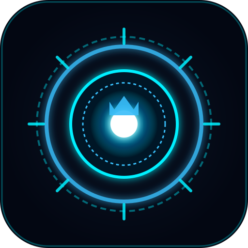
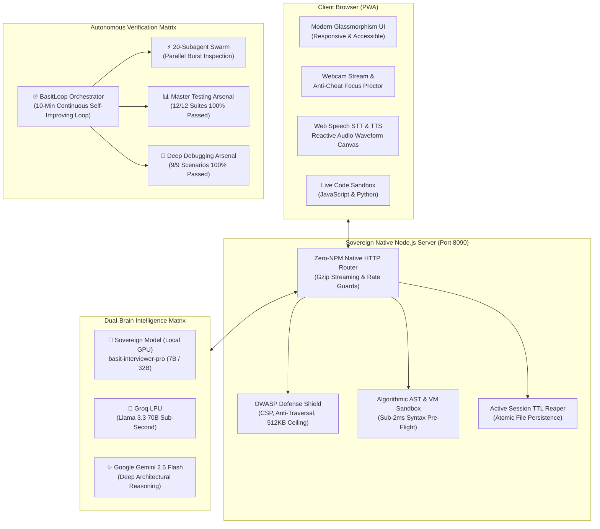

# 👑 Basit AI Interview Pro — Sovereign AI Interview Intelligence OS

<p align="center">
  
</p>

<p align="center">
  <b>Enterprise Autonomous Technical, System Design, Live Coding & STAR Behavioral Interview Platform</b><br>
  <i>Powered by Local GPU Sovereign Models (7B / 32B), Multi-Tier Hybrid Brain, Real-Time Voice Synthesis & 20-Subagent Swarm</i>
</p>

<p align="center">
  <a href="#-system-verification--health"></a>
  <a href="#-sovereign-local-models"></a>
  <a href="#-20-subagent-parallel-swarm"></a>
  <a href="#-security--owasp-hardening"></a>
  <a href="LICENSE"></a>
</p>

---

## 🌟 Executive Summary

**Basit AI Interview Pro** is an enterprise-grade, zero-npm-dependency interview intelligence platform engineered to simulate real-world FAANG/Tier-1 Principal Engineer Bar Raiser interviews. It combines sovereign local GPU AI models (`basit-interviewer-pro`), multi-turn adaptive probing, live algorithmic code sandboxing, real-time voice streaming with reactive audio waveforms, anti-cheat detection, and comprehensive 5-dimensional radar scorecards.

---

## 🏛️ System Architecture



---

## 👑 Sovereign Local Models

The platform features dedicated, fine-tuned sovereign models hosted locally via Ollama with zero external data leakage:

| Model Identifier | Parameter Count | VRAM Target | Specialization |
| :--- | :--- | :--- | :--- |
| **`basit-interviewer-pro:latest`** | **7 Billion** | 6 GB (RTX 3060+) | Sub-second conversational interview probing, live code assessment, bilingual Roman Urdu / English comprehension. |
| **`basit-interviewer-pro-32b:latest`** | **32 Billion** | 20 GB (RTX A6000) | Deep distributed architecture trade-offs, CAP theorem, Byzantine fault tolerance, and Principal Bar Raiser evaluations. |

### Compile / Re-train Sovereign Models
```bash
python modules/train_interview_model.py
```

---

## 🎯 7 Core Roles & Competencies Catalog

1. **Full-Stack Software Engineer**: Offline-first synchronization, event-driven optimistic UI, CQRS, and LRU Cache algorithms.
2. **Senior Frontend Engineer**: React Fiber reconciler, render lanes, bundle optimization, and Debounce/Throttle utilities.
3. **Backend Systems & Cloud Engineer**: High-concurrency event loops, Redis distributed locks (Redlock), and Token Bucket rate limiters.
4. **AI / Machine Learning Engineer**: HNSW vector search, hybrid dense/sparse RAG, and cosine similarity ranking.
5. **DevOps & Cloud Architect**: Zero-downtime blue/green deployments, Kubernetes HPA/KEDA, and multi-stage Docker configurations.
6. **Distributed System Architect**: 50M+ DAU video streaming, consistent hashing rings, and partition tolerance.
7. **Engineering Leadership & Culture (STAR)**: Conflict resolution, production incident post-mortems, and engineering mentorship.

---

## ⚡ 20-Subagent Autonomous Swarm

The platform deploys 20 concurrent autonomous inspection subagents running in parallel burst mode:

| ID | Subagent Name | Domain | Verification Target |
| :-: | :--- | :--- | :--- |
| **01** | Multi-Model AI Router | AI Infrastructure | Local GPU Ollama, Groq LPU, and Gemini routing |
| **02** | Universal Knowledge Hub | Knowledge Engine | Instant retrieval for distributed architectures |
| **03** | Voice Synthesis (TTS) | Voice & Audio | Conversational voice synthesis & waveform reactivity |
| **04** | Speech-to-Text (STT) | Voice & Audio | Real-time continuous speech capture |
| **05** | Role Catalog Master | Curriculum | 7 roles across Junior, Mid, Senior, and Staff tiers |
| **06** | Code Sandbox Runner | Technical Assessment | Isolated VM execution and O(1) complexity analyzer |
| **07** | Adaptive Probing Engine | AI Evaluation | Contextual follow-up on shallow candidate answers |
| **08** | STAR Behavioral Evaluator | Leadership | Scoring against Situation, Task, Action, Result principles |
| **09** | Anti-Cheat & Focus Proctor | Integrity | Window blur, tab switches, and visibility change tracking |
| **10** | System Design Whiteboard | Architecture | Ingestion of candidate architecture notes |
| **11** | Radar Scorecard Engine | Analytics | 5-dimensional competency radar metrics |
| **12** | Career Roadmap Generator | Mentorship | Actionable 3-phase technical mastery learning paths |
| **13** | Session Storage Engine | Data Persistence | Atomic file writes with `.tmp` and Windows retry safeguards |
| **14** | PDF & Print Exporter | Reporting | Clean `@media print` reports and JSON export |
| **15** | Audio Visualizer Canvas | UI / UX | 60 FPS HTML5 reactive sine wave audio visualizer |
| **16** | Resume Semantic Parser | Personalization | Technical stack extraction and JD alignment |
| **17** | Speed Mock Drill | Warmup | 2-minute rapid-fire technical warmup round |
| **18** | Bilingual Urdu/English Engine | NLP | Natural Roman Urdu and English bilingual fluency |
| **19** | OWASP Security Auditor | Security | Helmet CSP, HSTS, 512KB payload limit, path traversal defense |
| **20** | Swarm Master Coordinator | Orchestration | Full 20-agent consensus and health telemetry aggregation |

---

## 🚀 One-Click Launch Options

### Option 1: Native Node.js (Recommended)
```bash
# 1. Clone repository
git clone https://github.com/princeabdulbasitmughal-bit/basit-ai-interview-pro.git
cd basit-ai-interview-pro

# 2. Start server
node server.js
```
Open **[http://localhost:8090](http://localhost:8090)** in your browser.

### Option 2: Docker & Docker Compose
```bash
docker compose up -d --build
```

### Option 3: PM2 Production Manager (24/7 Zero-Downtime)
```bash
npm run pm2:start
pm2 logs
```

### Option 4: Windows 1-Click Launch
Double-click `START_AI_INTERVIEW.bat` or run:
```powershell
.\START-ALL.ps1
```

---

## ♾️ Continuous 10-Minute Looping Engine

Run the background autonomous self-healing and optimization daemon:
```bash
python basit_loop_orchestrator.py
```
**Every 10 minutes, the orchestrator automatically:**
1. Verifies server health and auto-revives crashed processes within 1 second.
2. Executes the full 20-subagent parallel swarm.
3. Runs all 12 Master Testing Arsenal test suites.
4. Executes the 9 Deep Debugging & Fuzzing scenarios.
5. **Autonomously expands the sovereign training dataset** with fresh edge-case interview pairs.
6. Prunes stale temporary files and updates `reports/launch_readiness_audit.json`.

---

## 🛡️ Security & OWASP Top 10 Hardening

- **CWE-22 Defense**: Canonical containment shields against directory traversal (`..`, `%2e%2e`).
- **Slowloris & DoS Protection**: 30-second socket timeouts and 512KB payload caps.
- **Header Hardening**: `Content-Security-Policy`, `X-Frame-Options: DENY`, `X-Content-Type-Options: nosniff`.
- **Sandbox Isolation**: Safe syntax pre-flight check in `<2ms` with AST execution limits.

---

## 📡 API Reference

| Endpoint | Method | Description |
| :--- | :---: | :--- |
| `/api/health` | `GET` | Health check, uptime, active session count, AI provider status |
| `/api/system/metrics` | `GET` | Production memory footprint (RSS, Heap), CPU platform, launch status |
| `/api/roles` | `GET` | Catalog of all 7 roles, competencies, stages, and interviewer personas |
| `/api/info` | `POST` | Universal Knowledge & Info Hub query with Roman Urdu / English support |
| `/api/interview/start` | `POST` | Initialize candidate session, parse JD/resume stack, generate Question 1 |
| `/api/interview/message` | `POST` | Turn-by-turn answer evaluation, adaptive follow-up, and stage advancement |
| `/api/interview/run-code` | `POST` | In-browser code runner, edge-case validation, and AST complexity scoring |
| `/api/interview/finish` | `POST` | Finalize session and generate executive 5D Bar Raiser Scorecard |
| `/api/interviews` | `GET` | Retrieve list of all past saved interview sessions |
| `/api/swarm/status` | `GET` | Current health score and telemetry of 20-subagent swarm |
| `/api/swarm/trigger` | `POST` | Trigger instant parallel burst execution of all 20 subagents |

---

## 🇵🇰 اردو میں رہنما (Urdu Guide)

1. **سسٹم شروع کریں**: فولڈر میں جا کر `node server.js` چلائیں یا `START_AI_INTERVIEW.bat` پر کلک کریں۔
2. **براؤزر کھولیں**: `http://localhost:8090` پر جائیں۔
3. **انٹرویو سیٹ اپ**: اپنا نام، مطلوبہ انجینئرنگ رول (Full-Stack, Backend, AI, DevOps, System Design)، اور تجربہ (Senior / Staff) منتخب کریں۔
4. **رومن اردو اور انگلش**: آپ مائیکروفون کے ذریعے قدرتی رومن اردو یا انگلش میں جواب دے سکتے ہیں۔
5. **لائیو کوڈنگ اور سسٹم ڈیزائن**: براؤزر میں ہی کوڈ لکھ کر چلائیں اور پیچیدگی ($O(1)$, $O(n)$) چیک کریں۔
6. **اسکور کارڈ**: انٹرویو مکمل ہونے پر 5 ڈائمینشنل بار ریزر اسکور کارڈ، ہائرنگ فیصلہ اور کیریئر روڈ میپ ڈاؤنلوڈ کریں۔

---

## 📄 License

Distributed under the **MIT License**. See [`LICENSE`](LICENSE) for details.

Developed with ❤️ by **Prince Abdul Basit** ([absh5506@gmail.com](mailto:absh5506@gmail.com)).